<!-- Banner / Header -->

<div align="center">

  

<p>
    <strong>🎓 Systems Analysis and Development Student</strong><br>
    Focused on <strong>Back-End & API Development</strong> | Passionate about continuous learning
  </p>

<p>
    <a href="https://www.linkedin.com/in/mellodev-">
      
    </a>
    <a href="mailto:joaovdmello@gmail.com">
      
    </a>
    <a href="https://discordapp.com/users/mefrog">
      
    </a>
  </p>

---

## 🧛🏻‍♂️ About Me

```typescript
const joaoMello = {
  code: ["TypeScript", "JavaScript", "Python"],
  technologies: {
    backEnd: {
      runtime: ["Node.js"],
      databases: ["PostgreSQL", "MongoDB", "SQLite"],
      tools: ["Git", "VS Code", "Postman"]
    },
    learning: ["REST APIs", "OOP", "SOLID Principles", "DDD"],
  },
  currentFocus: "Building scalable back-end solutions",
  funFact: "I believe in learning by doing! 🚀"
};
```

- 🎓 Studying **Systems Analysis and Development** at Cesuca
- � Specialized in **back-end development** with focus on Node.js ecosystem
- 🔧 Building **REST APIs**, automation tools, and management systems
- � **Constantly learning** new technologies and best practices
- 🎯 Seeking: **Internship opportunities** and **open source contributions**
- 🌱 Growing as a developer every single day!

---

## 🛠️ Tech Stack & Skills

<div align="center">

### 💻 Programming Languages

<p>
  
</p>

### 🚀 Frameworks & Runtime

<p>
  
</p>

### 🗄️ Databases

<p>
  
</p>

### 🔧 Tools & Technologies

<p>
  
</p>

### 📚 Currently Learning

<p>
  
</p>

</div>

---

## 🏆 Certifications & Achievements

<div align="center">

| 🎯 Category             | 📚 Course                 | ✅ Status    |
| ----------------------- | ------------------------- | ------------ |
| **Development**   | Git & GitHub Fundamentals | Completed ✓ |
| **Back-End**      | Node.js Foundations       | Completed ✓ |
| **Soft Skills**   | Time Management           | Completed ✓ |
| **Communication** | Assertive Communication   | Completed ✓ |
| **Methodology**   | Agile Methodologies       | Completed ✓ |

<a href="https://app.rocketseat.com.br/me/mxrvit">
  
</a>

</div>

---

## 📊 GitHub Statistics

<div align="center">


  


<details>
    <summary>📈 More Stats</summary>
    <br>
    
  </details>

</div>

---

## 🚀 Featured Projects

<div align="center">

<table>
  <tr>
    <td width="50%">
      <h3 align="center">🏋️ API GymPass App</h3>
      <div align="center">  
        <a href="https://github.com/melloxyz/api-gympass-app">
          
        </a>
        <p>
          
          
        </p>
        <p><strong>GymPass Style App API</strong> - Complete fitness management system</p>
      </div>
    </td>
    <td width="50%">
      <h3 align="center">💰 API REST Finance</h3>
      <div align="center">  
        <a href="https://github.com/melloxyz/api-rest-finance">
          
        </a>
        <p>
          
          
        </p>
        <p><strong>Financial Management API</strong> - Track your finances efficiently</p>
      </div>
    </td>
  </tr>
  <tr>
    <td width="50%">
      <h3 align="center">🥗 Daily Diet API</h3>
      <div align="center">
        <a href="https://github.com/melloxyz/api-daily-diet">
          
        </a>
        <p>
          
          
        </p>
        <p><strong>Diet Tracking REST API</strong> - Monitor your daily nutrition</p>
      </div>
    </td>
    <td width="50%">
      <h3 align="center">🔍 More Projects</h3>
      <div align="center">
        <br><br>
        <a href="https://github.com/melloxyz?tab=repositories">
          
        </a>
        <br><br>
        <p>Check out more of my work!</p>
      </div>
    </td>
  </tr>
</table>

</div>

---

## 🎯 Learning Journey & Roadmap

```mermaid
graph LR
    A[🎓 Student] --> B[📚 Learning]
    B --> C[💻 Building]
    C --> D[🚀 Growing]
    D --> E[🎯 Professional]
  
    style A fill:#58a6ff
    style B fill:#1f6feb
    style C fill:#1f6feb
    style D fill:#1f6feb
    style E fill:#238636
```

<div align="center">



</div>

### ✅ Currently Mastering

<table>
  <tr>
    <td>
      
      
    </td>
    <td>Building enterprise-level applications with type safety</td>
  </tr>
  <tr>
    <td>
      
      
    </td>
    <td>Design patterns, best practices, and implementation</td>
  </tr>
  <tr>
    <td>
      
      
    </td>
    <td>Database management, queries, and optimization</td>
  </tr>
  <tr>
    <td>
      
      
    </td>
    <td>Object-Oriented Programming principles and patterns</td>
  </tr>
</table>

### 🔥 Next Steps

- 🏗️ **SOLID Principles** - Writing maintainable code
- 🎨 **Domain Driven Design (DDD)** - Better architecture
- 🦅 **NestJS** - Scalable Node.js applications
- ✅ **Testing** - Jest & Vitest implementation
- 🐳 **Docker** - Containerization practices

### 🚧 In Progress

- 🤝 Contributing to **open source projects**
- 🏢 Building **microservices architecture**
- 💼 Securing a **back-end development internship**
- � Deepening **software architecture** knowledge

### 📋 Future Goals

- ☁️ **Cloud Deployment** (AWS, Railway, Vercel)
- 🧪 **Advanced Testing** strategies
- 🏛️ **Clean Architecture** implementation
- 🔐 **Security** best practices
- 📊 **Performance Optimization** techniques

---

## 💼 Open to Opportunities

<div align="center">

<table>
  <tr>
    <td align="center">
      
      <br><strong>Internships</strong>
      <br>Back-End Development
    </td>
    <td align="center">
      
      <br><strong>Open Source</strong>
      <br>Collaboration & Learning
    </td>
    <td align="center">
      
      <br><strong>Mentorship</strong>
      <br>Software Architecture
    </td>
    <td align="center">
      
      <br><strong>Projects</strong>
      <br>API Development
    </td>
  </tr>
</table>

### 📫 Let's Connect!

<p>
  <a href="https://www.linkedin.com/in/mellodev-">
    
  </a>
  <a href="mailto:joaovdmello@gmail.com">
    
  </a>
  <a href="https://discordapp.com/users/mefrog">
    
  </a>
</p>

</div>

---

<div align="center">

### 💭 Developer Quote

  

<br>

### � Contribution Graph

  

<br>


<p>
    <strong>⭐ Thanks for visiting! Feel free to explore my repositories and connect! ⭐</strong>
  </p>

<p>
    <em>"Building tomorrow's solutions with today's code"</em> 🚀
  </p>

<p>
    <sub>Made with ❤️ by João Mello | Always learning, always growing 🌱</sub>
  </p>

</div>
